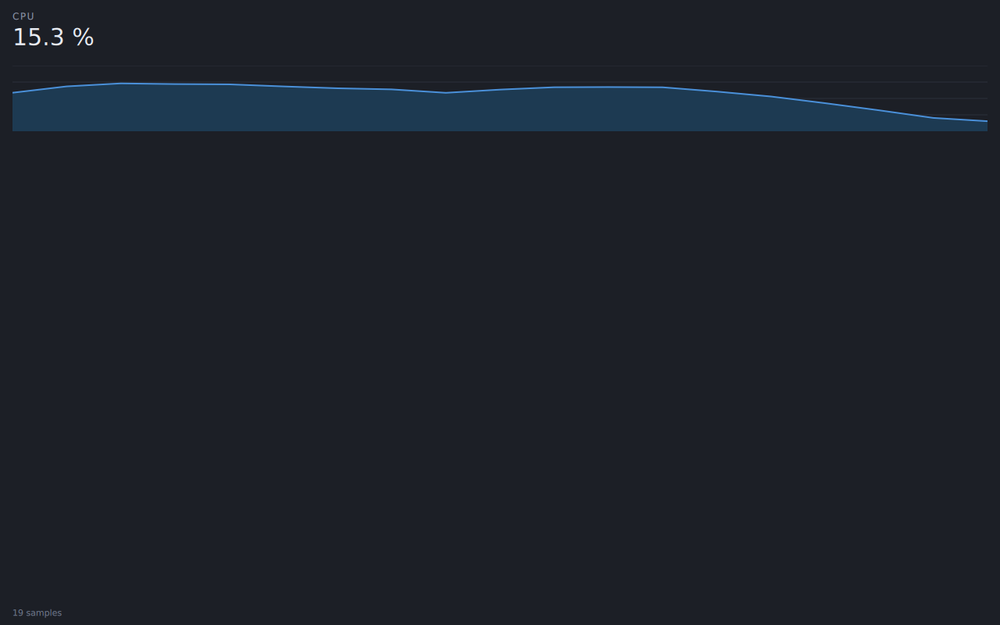
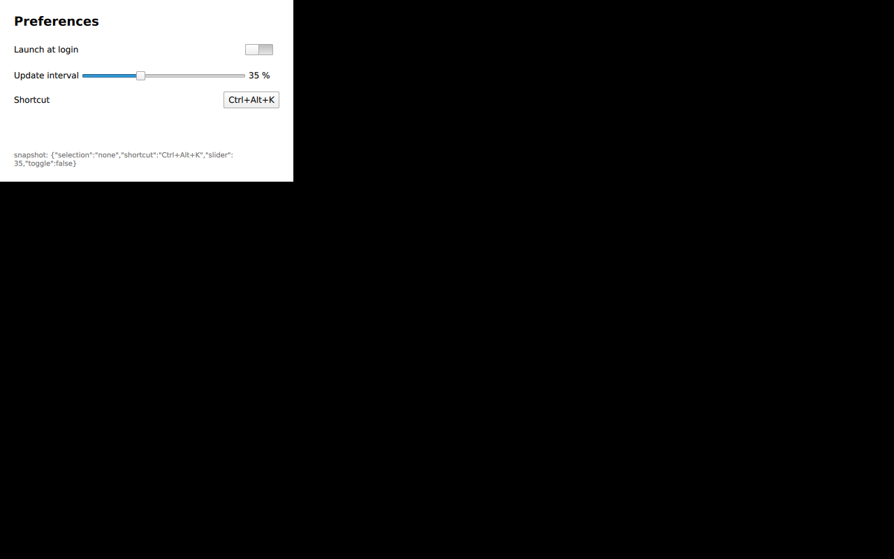
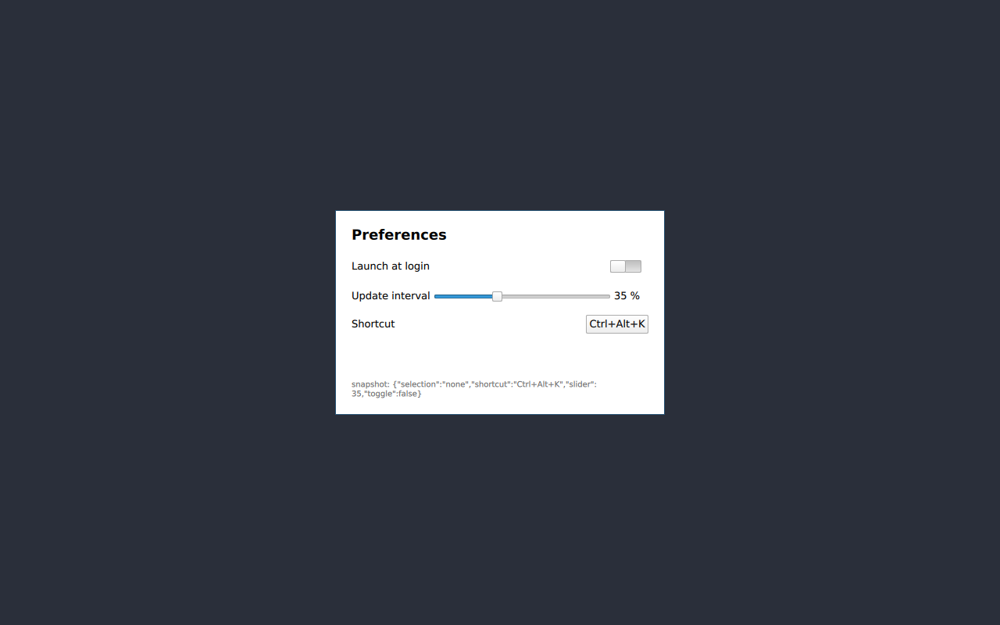
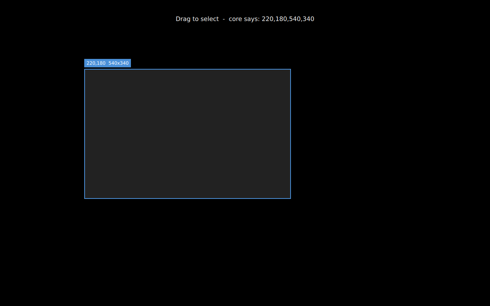
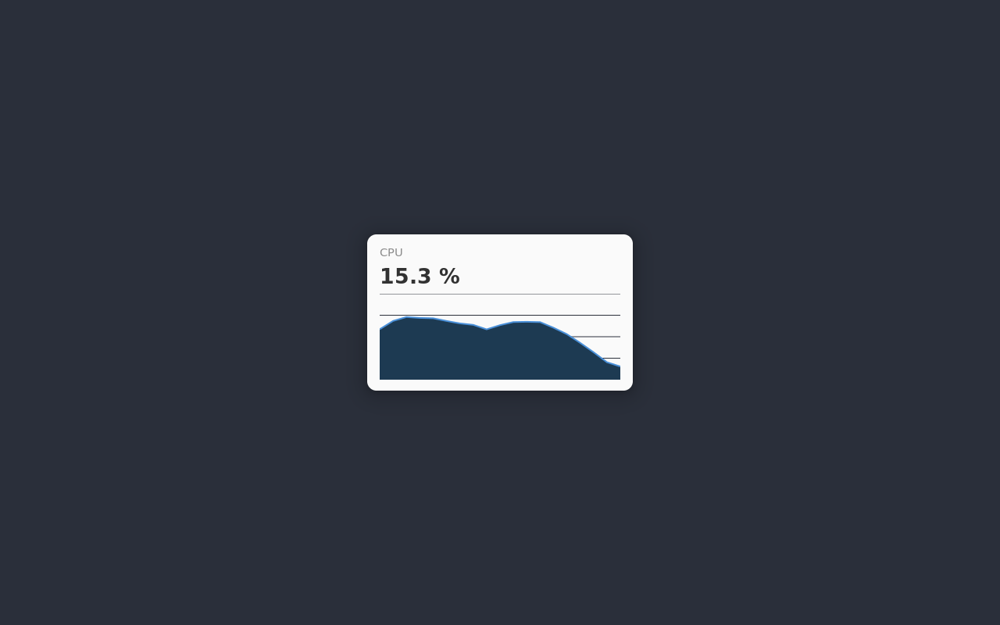
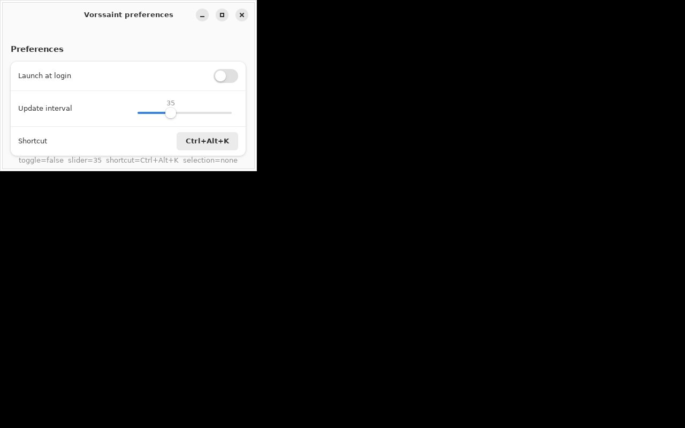
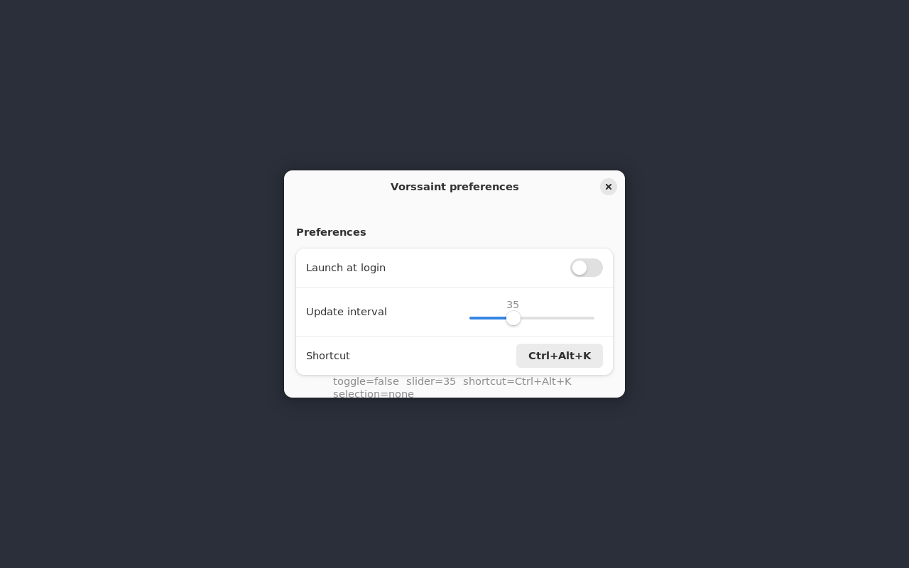
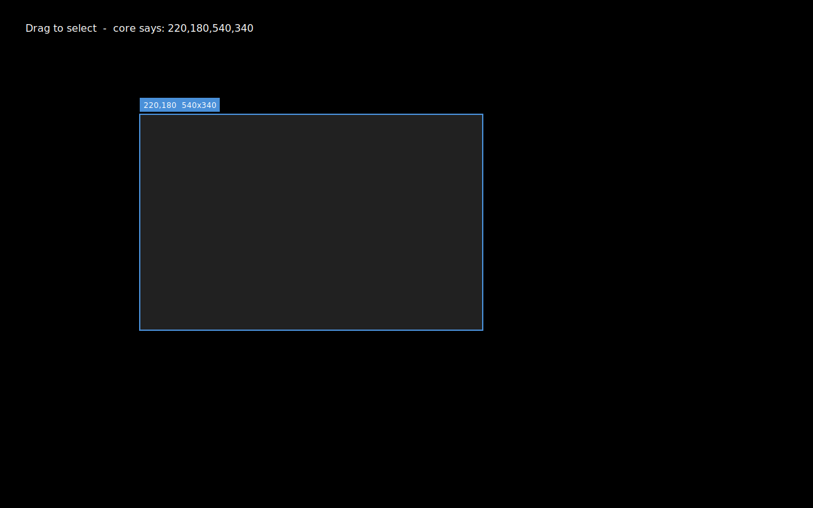
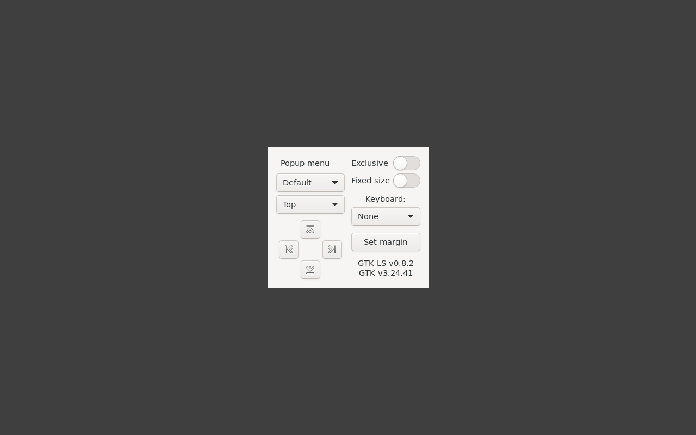

# WP-01 — Shell toolkit bake-off

Spike report. Code: `spikes/wp01-toolkit/`. Status: complete, with two of the
four candidates built and measured and two covered by desk research only.

**Recommendation: keep the plan's default — Qt 6 Quick with a C++ `CoreModel`
over the `@_cdecl` bridge (candidate a).** It won on every measured axis
(memory, view-code volume, tray effort, theming reach) and it is the only
candidate whose whole surface could be exercised here. The two Swift-side
candidates could not be built at all in this environment and must not be
scored as if they had been.

---

## 1. What this environment could and could not do

The spike ran in the port team's Ubuntu 24.04 container: no desktop session,
no display, no GPU, 4 CPUs, microVM kernel 6.18.

**Could not be done here, and therefore is not claimed anywhere below:**

| Not verified | Why | Evidence |
|---|---|---|
| Candidates (b) Qt Bridge for Swift and (c) Adwaita for Swift — *built, run, measured* | No Swift toolchain is installable. `download.swift.org` is refused by the egress proxy. | `curl -sSL -o /dev/null -w "%{http_code}" https://download.swift.org/swift-6.0.3-release/ubuntu2404/swift-6.0.3-RELEASE/swift-6.0.3-RELEASE-ubuntu24.04.tar.gz` → `curl: (56) CONNECT tunnel failed, response 403`. `https://www.swift.org/` itself returns 200, so this is a per-host block, not a network outage. |
| Primary-source facts about (b) and (c) | `github.com`, `www.qt.io`, `forums.swift.org`, `swiftpackageindex.com` and `git.aparoksha.dev` are all refused by the proxy. | `curl` → 403 for github.com; `WebFetch` → `EGRESS_BLOCKED` for the other four. Only search-engine *summaries* were reachable. Everything in § 6 is therefore second-hand and marked as such. |
| Look on real GNOME 48 / KDE Plasma 6 | No GNOME or KDE session exists here, and neither can be installed and run headless in a useful way. The screenshots below are sway (wlroots) and bare Xvfb with **no** platform theme, which is the *worst* case for both toolkits, not a representative one. | § 4 screenshots; § 5.6 explains what the theming packages would change. |
| Real hardware GPU behaviour | No DRM device; everything renders through llvmpipe or a software rasteriser. RSS numbers in § 5.3 are reported both ways for this reason. | `MESA: error: ZINK: vkCreateInstance failed (VK_ERROR_INCOMPATIBLE_DRIVER)` in every run log. |

Per the WP's amended brief, the Swift fake service behind the bridge was
replaced by a C stub library with the identical C ABI (§ 2), and candidate (d)
**GTK4/libadwaita in C** was built as the stand-in for (c)'s look-and-bundling
questions, since it is the same toolkit underneath.

Environment versions used for every number below:

```
$ grep PRETTY /etc/os-release;  qmake6 -query QT_VERSION
PRETTY_NAME="Ubuntu 24.04.4 LTS"
6.4.2
$ pkg-config --modversion gtk4 libadwaita-1 json-glib-1.0
4.14.5
1.5.0
1.8.0
$ sway --version;  gcc --version | head -1;  cmake --version | head -1;  nproc
sway version 1.9
gcc (Ubuntu 13.3.0-6ubuntu2~24.04.1) 13.3.0
cmake version 3.28.3
4
```

---

## 2. The bridge stub API

`spikes/wp01-toolkit/corebridge-stub/corebridge.h`, inlined in full. It is
written so that a Swift `@_cdecl` library can replace the C implementation
without either shell changing a line; the Swift declarations that produce this
exact ABI are in the header comment.

```c
/*
 * corebridge.h - the C ABI that VorssaintCore exports from Swift via @_cdecl.
 *
 * This header is written to be byte-for-byte compatible with what the Swift
 * declarations below would produce, so the stub can be swapped for the real
 * Swift library without touching a single line of shell code:
 *
 *   @_cdecl("vs_subscribe")
 *   public func vs_subscribe(_ service: UnsafePointer<CChar>,
 *                            _ callback: @convention(c) (UnsafePointer<CChar>?,
 *                                                        UnsafeMutableRawPointer?) -> Void,
 *                            _ ctx: UnsafeMutableRawPointer?) -> Int32
 *
 *   @_cdecl("vs_command")
 *   public func vs_command(_ service: UnsafePointer<CChar>,
 *                          _ json: UnsafePointer<CChar>) -> Int32
 *
 *   @_cdecl("vs_snapshot")
 *   public func vs_snapshot(_ service: UnsafePointer<CChar>) -> UnsafeMutablePointer<CChar>?
 *
 * Swift's @_cdecl emits plain C functions with no name mangling, so an
 * `extern "C"` block is all the C++ side needs. Ownership rules match what a
 * Swift `strdup`-style return implies: the caller frees the vs_snapshot
 * result with vs_free().
 */
#ifndef VORSSAINT_COREBRIDGE_H
#define VORSSAINT_COREBRIDGE_H

#ifdef __cplusplus
extern "C" {
#endif

/* Called on the bridge's own thread with a NUL-terminated JSON snapshot.
 * The pointer is owned by the bridge and is only valid for the duration of
 * the call; the shell must copy or marshal it to its UI thread. */
typedef void (*vs_snapshot_callback)(const char *json, void *ctx);

/* Subscribe to a service's snapshot stream. Returns a subscription token
 * (>= 1) on success, or -1 if the service is unknown. The callback fires
 * once immediately with the current snapshot, then on every change. */
int vs_subscribe(const char *service, vs_snapshot_callback callback, void *ctx);

/* Deliver a command to a service. `json` is the Codable command enum encoded
 * as JSON, for example {"set":{"key":"toggle","value":true}} or
 * {"recordShortcut":"Ctrl+Alt+K"}. Returns 0 on success, -1 on an unknown
 * service, -2 on a command the service rejected. */
int vs_command(const char *service, const char *json);

/* Current snapshot of a service as a newly allocated NUL-terminated JSON
 * string, or NULL if the service is unknown. Free with vs_free(). */
char *vs_snapshot(const char *service);

/* Free a string returned by vs_snapshot(). */
void vs_free(char *s);

#ifdef __cplusplus
}
#endif

#endif /* VORSSAINT_COREBRIDGE_H */
```

The stub (`corebridge.c`, 196 code lines) serves two fake services:

- **`metrics`** — `{"cpu":<0..100>,"history":[<up to 60 samples>]}`, pushed to
  every subscriber every 500 ms from its own thread.
- **`settings`** — `{"toggle":<bool>,"slider":<0..100>,"shortcut":"<chord>",
  "selection":"<x,y,w,h>"}`, pushed on every accepted command.

Commands accepted: `{"set":{"key":…,"value":…}}` and
`{"recordShortcut":"Ctrl+Alt+K"}`, as specified.

Both shells therefore exercise the full round trip: the value a screen shows
is the value that came *back* out of the bridge after the command went in.
That is visible in the screenshots — the preferences shot reads
`shortcut=Ctrl+Alt+K` because a `vs_command` was sent and the resulting
snapshot re-rendered the button, and the overlay shot reads
`core says: 220,180,540,340` for the same reason.

Build check (no warnings at `-Wall -Wextra`):

```
$ gcc -std=c11 -O2 -Wall -Wextra -fPIC -shared -o /tmp/wp01/libcorebridge.so \
      spikes/wp01-toolkit/corebridge-stub/corebridge.c -lm -lpthread
   (no output)
```

---

## 3. Scored matrix

Scores are 1–5, higher is better. **Every row for (b) and (c) is marked
`unbuilt`** — those are desk-research impressions from § 6, not measurements,
and the lead should treat them as unresolved rather than as evidence.

| Criterion | (a) Qt 6 Quick + C++ `CoreModel` | (b) Qt Bridge for Swift | (c) Adwaita for Swift | (d) GTK4/libadwaita in C |
|---|---|---|---|---|
| **Built and run here** | **yes** | **no — unbuilt** | **no — unbuilt** | **yes** |
| Maintenance activity | 5 — Qt 6.4.2 in Ubuntu 24.04, KDE ships on it | `unbuilt` ~2 — Qt's own, but early preview, no releases | `unbuilt` ~3 — active, small team, 1.0 reportedly 2026 | 5 — GTK 4.14.5 / libadwaita 1.5.0, GNOME ships on it |
| Binary size | 4 — 73 192 B | `unbuilt` | `unbuilt` | 4 — 55 304 B |
| Shared-lib closure to ship | 3 — 83 MiB + ~11 MiB plugins/QML | `unbuilt` (same Qt closure + Swift runtime) | `unbuilt` (same GTK closure + Swift runtime) | 3 — 75 MiB + ~17 MiB icons/schemas/loaders |
| **Memory (RSS, 10 s, software renderer)** | **5 — 50.2 MiB** | `unbuilt` | `unbuilt` | **2 — 112.2 MiB** |
| Memory (RSS, 10 s, llvmpipe GL) | 4 — 155.5 MiB | `unbuilt` | `unbuilt` | 3 — 189.7 MiB |
| Build reproducibility | 5 — CMake + apt Qt6, 3.8 s clean | `unbuilt` — needs a toolchain this env cannot install | `unbuilt` — same | 5 — CMake + pkg-config, 0.9 s clean |
| **View code, three screens** | **5 — 216 QML lines** | `unbuilt` (QML views, so ≈ the same 216) | `unbuilt` (declarative Swift, plausibly fewer) | **2 — 318 C lines** |
| Declarativeness vs the SwiftUI it replaces | 4 — QML is declarative with property binding; different language | `unbuilt` ~4 | `unbuilt` ~5 — SwiftUI-shaped by design | 1 — imperative C, no binding; every value wired by hand |
| **Tray (StatusNotifierItem)** | **5 — 12 lines, `QSystemTrayIcon`, verified over D-Bus** | `unbuilt` ~5 (same Qt tray underneath) | `unbuilt` ~1 (same GTK4 gap) | **1 — 82 hand-written lines; GTK4 has no tray API** |
| **`layer-shell` support** | **1 — no Qt6 binding packaged in 24.04** | `unbuilt` ~1 (same gap) | `unbuilt` ~1 (same gap) | **1 — no GTK4 binding packaged in 24.04** |
| Look on GNOME | `unverified` — `qt6-gtk-platformtheme`, `qt6-xdgdesktopportal-platformtheme`, `adwaita-qt6` all packaged | `unbuilt` | `unbuilt` | `unverified` — native by construction |
| Look on KDE | `unverified` — Qt is KDE's own toolkit | `unbuilt` | `unbuilt` | `unverified` — foreign; no Qt platform theme applies to GTK |
| AppImage bundling effort | 3 — plugins + QML tree, `linuxdeploy-plugin-qt` exists (but is a GitHub download, blocked here) | `unbuilt` | `unbuilt` | 2 — no AppImage plugin; schemas, pixbuf loaders, GIO modules and a 14 MiB icon theme are manual |

### Where the scores come from

- **Memory** is the single biggest measured gap and the strongest signal:
  Qt uses **45 % of GTK's RSS** with the software renderer (50.2 vs 112.2 MiB)
  and 82 % with llvmpipe. For a menu-bar utility that sits resident all day,
  that matters more than the 8 MiB difference in shipped library bytes.
- **View code** is the second: the same three screens are 216 lines of QML
  against 318 lines of C, and the C is the harder 318 — every label update,
  redraw and re-entrancy guard is explicit (see the `applying` flag in
  `gtk4/preferences.c`, which exists only to stop a snapshot write from
  re-emitting a command).
- **Tray** is the third and is a step change, not a gradient: `QSystemTrayIcon`
  is 12 lines and GTK4 needs 82 lines of hand-written D-Bus for a *deliberately
  minimal* item with no menu. Adding the `com.canonical.dbusmenu` that WP-21's
  per-readout tray items require would add several hundred more.
- **layer-shell scores 1 for everything**, which is the report's main
  unwelcome finding. See § 5.5.

---

## 4. Screenshots

All taken headless. Left column is bare Xvfb (no window manager, no
compositor, no platform theme); right column is headless sway 1.9 with the
wlroots headless backend and the pixman software renderer.

### Candidate (a) Qt 6 Quick

Panel — live CPU sparkline driven by the `metrics` service:

| Xvfb | sway |
|---|---|
|  |  |

Preferences — toggle, slider, shortcut recorder. The button reads
`Ctrl+Alt+K` and the debug line at the bottom is the raw snapshot the bridge
returned after the `recordShortcut` command:

| Xvfb | sway |
|---|---|
|  |  |

Overlay — transparent fullscreen, drag rectangle, the selected rect sent to
the core and read back (`core says: 220,180,540,340`):

| Xvfb | sway |
|---|---|
|  |  |

> The Xvfb overlay image is **solid black, and that is the real result, not a
> broken capture.** A transparent ARGB window on X11 with no compositing
> manager running has nothing to composite against, so `import -window root`
> captures the black root. The rectangle logic ran correctly in the same run —
> `qml: selected rect: 220,180,540,340` appears in the app log. The sway
> capture beside it shows what the same code draws when a compositor exists.
> Every overlay surface on X11 will need a compositor check at runtime; noted
> for WP-29.

### Candidate (d) GTK4 / libadwaita

| | Xvfb | sway |
|---|---|---|
| Panel |  |  |
| Preferences |  |  |
| Overlay |  |  |

The GTK Xvfb overlay shows the same no-compositor artefact, worse: a stale
partial first frame. Its drag logic also ran (`selected rect: 220,180,540,340`
in the app log) and the sway capture is correct.

### layer-shell on the same compositor

Proof that the compositor is not the limitation — GTK **3**'s
`gtk-layer-shell` 0.8.2 binding driving a layer surface on the same headless
sway that both spikes ran on:



Commands that produced the screenshots:

```
$ ./spikes/wp01-toolkit/run-xvfb.sh  <out.png> <binary> --screen <panel|prefs|overlay> [--demo-drag] --quit-after 13000
$ ./spikes/wp01-toolkit/run-sway.sh  <out.png> <binary> --screen <panel|prefs|overlay> [--demo-drag] --quit-after 15000
```

Both harnesses are committed. `run-xvfb.sh` starts `Xvfb :NN -screen 0
1280x800x24`, a private `dbus-launch` session bus and the fake
StatusNotifierWatcher, then captures with `import -window root`. `run-sway.sh`
starts sway with `WLR_BACKENDS=headless WLR_RENDERER=pixman
WLR_LIBINPUT_NO_DEVICES=1` and captures with `grim`. PNGs were re-encoded with
`convert -strip -define png:compression-level=9`; the largest is 26.8 KB,
well under the 300 KB cap.

**On `--demo-drag`:** the container has no `/dev/input` and no pointer device,
so the overlay's drag is replayed by a timer that calls the *same*
`beginAt`/`extendTo`/`finish` functions the real `MouseArea` / `GtkGestureDrag`
handlers call. The geometry and the bridge round trip are genuine; the pointer
motion is not. This is stated in the source of both overlays.

---

## 5. Measurements

### 5.1 Build time (clean build directory, Ninja, `-DCMAKE_BUILD_TYPE=Release`, 4 CPUs)

```
$ rm -rf /tmp/wp01/build-qt
$ cmake -S spikes/wp01-toolkit/qt-quick -B /tmp/wp01/build-qt -G Ninja -DCMAKE_BUILD_TYPE=Release
$ T0=$(date +%s.%N); cmake --build /tmp/wp01/build-qt; T1=$(date +%s.%N); echo "$T1 - $T0" | bc
3.842477371
```

```
$ rm -rf /tmp/wp01/build-gtk
$ cmake -S spikes/wp01-toolkit/gtk4 -B /tmp/wp01/build-gtk -G Ninja -DCMAKE_BUILD_TYPE=Release
$ T0=$(date +%s.%N); cmake --build /tmp/wp01/build-gtk; T1=$(date +%s.%N); echo "$T1 - $T0" | bc
.854586188
```

| | Qt 6 Quick | GTK4/libadwaita |
|---|---|---|
| Clean build | **3.84 s** (12 targets, includes `automoc` + `autorcc`) | **0.85 s** (7 targets) |
| Warnings at default flags | 0 | 0 |

GTK is 4.5× faster to build, entirely because Qt runs `moc` and `rcc` and
compiles C++. At this size neither number is a decision input; at the real
app's size Qt's C++ compile will dominate, which is a cost the port pays once
per CI run, not per developer keystroke.

### 5.2 Binary + shared-library closure

`spikes/wp01-toolkit/measure.sh` sums every library `ldd` resolves, minus what
an AppImage does not ship (glibc family, and the host-provided mesa/GL/X11-core
stack).

```
$ bash spikes/wp01-toolkit/measure.sh /tmp/wp01/build-qt/vorssaint-qt-spike "Qt 6 Quick"
### Qt 6 Quick
binary: 73192 bytes  (/tmp/wp01/build-qt/vorssaint-qt-spike)
libs resolved by ldd: 84
libs counted (excl. glibc/mesa/X11-core): 64
closure size counted: 87783912 bytes (83 MiB)
top 10 counted libs:
   30073.6 KiB  libicudata.so.74
    7373.2 KiB  libQt6Widgets.so.6
    7299.0 KiB  libQt6Gui.so.6
    5151.9 KiB  libQt6Core.so.6
    5074.2 KiB  libQt6Qml.so.6
    3374.3 KiB  libicui18n.so.74
    2090.2 KiB  libicuuc.so.74
    2017.4 KiB  libgnutls.so.30
    1843.5 KiB  libgio-2.0.so.0
    1714.2 KiB  libunistring.so.5
```

```
$ bash spikes/wp01-toolkit/measure.sh /tmp/wp01/build-gtk/vorssaint-gtk-spike "GTK4 / libadwaita"
### GTK4 / libadwaita
binary: 55304 bytes  (/tmp/wp01/build-gtk/vorssaint-gtk-spike)
libs resolved by ldd: 106
libs counted (excl. glibc/mesa/X11-core): 86
closure size counted: 79112576 bytes (75 MiB)
top 10 counted libs:
   30073.6 KiB  libicudata.so.74
   11517.1 KiB  libgtk-4.so.1
    2286.4 KiB  libadwaita-1.so.0
    2090.2 KiB  libicuuc.so.74
    2017.4 KiB  libgnutls.so.30
    1921.3 KiB  libxml2.so.2
    1843.5 KiB  libgio-2.0.so.0
    1714.2 KiB  libunistring.so.5
    1673.8 KiB  libp11-kit.so.0
    1311.6 KiB  libglib-2.0.so.0
```

Two caveats on these 83 / 75 MiB figures:

1. **29 MiB of each is `libicudata.so.74`**, the ICU locale blob, pulled in by
   both toolkits. It is the single largest item on both sides and is a
   *shared* problem, not a differentiator. ICU data can be trimmed to the
   thirteen shipped locales; that is a WP-04 task worth roughly 25 MiB on
   either candidate.
2. **`ldd` does not see what is `dlopen`ed at runtime.** § 5.4 measures that
   separately, and it is where the real bundling difference lives.

### 5.3 RSS after 10 s

`/tmp/wp01/rss.sh`: three repetitions per configuration, panel screen, on one
Xvfb with a session bus and the fake watcher running, `ps -o rss= -p <pid>` at
t = 10 s.

```
qt6-quick   default(llvmpipe GL):       155516 155444 155980 KiB
gtk4-adw    default(llvmpipe GL):       189760 189692 189660 KiB
qt6-quick   QT_QUICK_BACKEND=software:   50284  50240  50220 KiB
gtk4-adw    GSK_RENDERER=cairo:         112192 112172 112300 KiB
```

| Renderer | Qt 6 Quick | GTK4/libadwaita | Qt as % of GTK |
|---|---|---|---|
| llvmpipe GL (the container default) | 155.5 MiB | 189.7 MiB | 82 % |
| Software rasteriser | **50.2 MiB** | **112.2 MiB** | **45 %** |

Spread across three runs is under 0.6 MiB in every configuration, so these are
solid numbers for this environment. The software-renderer row is the fairer
toolkit comparison because it removes llvmpipe, which is a container artefact
and would be absent on real hardware — but note it is *not* the configuration
the app would ship in, so treat 50/112 as the toolkit's own cost and 155/190
as an upper bound. **Neither row is a prediction of RSS on a GPU session**;
that needs re-measuring in WP-P3 on real hardware.

### 5.4 Lines of view code per screen

`/tmp/wp01/loc.sh`. "code" excludes blank lines and whole-line comments.

| Screen | Qt (QML) | GTK4 (C) | GTK / Qt |
|---|---|---|---|
| Panel (tray popover + sparkline) | 72 | 76 | 1.06× |
| Preferences (toggle, slider, recorder) | 76 | 131 | 1.72× |
| Overlay (transparent + drag rect) | 68 | 111 | 1.63× |
| **Three screens** | **216** | **318** | **1.47×** |

Supporting code, written once:

| Layer | Qt | GTK4 |
|---|---|---|
| Generic bridge binding (`CoreModel`) | 66 (`CoreModel.h` + `.cpp`) | 135 (`core_model.h` + `.c`) |
| Tray entry point | **12** (a `QSystemTrayIcon` block in `main.cpp`) | **82** (`sni.c`, hand-written StatusNotifierItem over GDBus) |
| App entry point | 62 | 41 |

The panel is nearly a tie because it is mostly a cairo/Canvas draw function
either way. The gap opens on the screens with *state*: the preferences screen
is 1.7× because QML's property binding does for free what GTK needs an
explicit `on_settings_changed` handler, four widget setters and a re-entrancy
guard to do.

Against the SwiftUI it replaces, QML is a different language but the same
shape — declarative tree, bindings, no manual invalidation. The GTK4 C code is
a different *paradigm*, and porting 232 SwiftUI views into it would be a
rewrite rather than a translation.

### 5.5 `layer-shell` — the significant negative finding

**Neither built candidate can use `zwlr_layer_shell_v1` on Ubuntu 24.04,
because neither has a packaged binding for its major version.** `PLAN.md` § 4.2
lists `layer-shell-qt` as an advantage of Qt 6; that is true of Qt 5 on this
distribution and not of Qt 6.

```
$ apt-cache search layer-shell
gtk-layer-shell-doc - documentation for the Wayland Layer Shell protocol desktop component library
gtk-layer-shell-examples - example files for the Wayland Layer Shell protocol desktop component library
layer-shell-qt - use the Wayland wl-layer-shell protocol - plugin
libgtk-layer-shell-dev - Wayland Layer Shell protocol desktop component library -- development files
libgtk-layer-shell0 - Wayland Layer Shell protocol desktop component library
liblayershellqtinterface-dev - use the Wayland wl-layer-shell protocol - development files
liblayershellqtinterface5 - use the Wayland wl-layer-shell protocol - run-time library
```

Both are the wrong major version:

```
$ apt-cache policy layer-shell-qt | grep Installed
  Installed: 5.27.11-0ubuntu3
$ grep -i "Qt[56]" /usr/lib/x86_64-linux-gnu/cmake/LayerShellQt/LayerShellQtConfig.cmake
find_dependency(Qt5Gui "5.15.2")
$ objdump -p /usr/lib/x86_64-linux-gnu/libLayerShellQtInterface.so.5.27.11 | grep NEEDED
  NEEDED               libwayland-client.so.0
  NEEDED               libQt5WaylandClient.so.5
  NEEDED               libQt5Gui.so.5
  NEEDED               libQt5Core.so.5
  ...
```

```
$ grep "^Requires" /usr/lib/x86_64-linux-gnu/pkgconfig/gtk-layer-shell-0.pc
Requires.private: gtk+-3.0 >= 3.22.0, wayland-client >= 1.10.0
$ apt-cache policy libgtk4-layer-shell-dev gtk4-layer-shell
   (no output — no such package in noble)
```

So: `layer-shell-qt` in noble is **KDE Plasma 5.27, linked against Qt 5**, and
`gtk-layer-shell` is **GTK 3 only**. There is **no `gtk4-layer-shell` package
in Ubuntu 24.04 at all** (this corrects the package name assumed in the WP
brief).

Qt 6's own Wayland shell plugins confirm the gap:

```
$ ls /usr/lib/x86_64-linux-gnu/qt6/plugins/wayland-shell-integration/
libfullscreen-shell-v1.so  libivi-shell.so  libqt-shell.so  libwl-shell-plugin.so  libxdg-shell.so
```

— `xdg-shell` and four others, no layer-shell.

**The compositor is not the problem.** The same headless sway advertises the
protocol at version 4, and GTK 3's binding drives it successfully (screenshot
in § 4):

```
$ wayland-info | grep -E "interface:.*(layer_shell|xdg_wm_base|foreign_toplevel|data_control)"
interface: 'zwlr_layer_shell_v1',                        version:  4, name:  9
interface: 'xdg_wm_base',                                version:  2, name: 10
interface: 'zwlr_foreign_toplevel_manager_v1',           version:  3, name: 21
interface: 'zwlr_data_control_manager_v1',               version:  2, name: 25
$ gtk-layer-demo   # on that sway; grim captured a layer surface, 28258 bytes
```

Consequences for the plan:

- WP-29 must either **vendor and build `LayerShellQt` against Qt 6** (upstream
  KDE has a Qt 6 branch; it is a small CMake project, and the AppImage ships
  it anyway, so a vendored build is cheap) **or** ship only the fullscreen
  frameless fallback. The fallback was verified working on sway for both
  candidates in § 4, so this is a quality gap, not a blocker.
- Either way, **`layer-shell` availability stops being a reason to prefer Qt
  over GTK**, because both need the same vendoring work. The recommendation in
  § 7 therefore does not rest on it.

### 5.6 Tray / StatusNotifierItem

Verified for real, not asserted. The container has no panel, so nothing owns
`org.kde.StatusNotifierWatcher`; `spikes/wp01-toolkit/sni-watcher.py` stands in
for one, claims the name, and prints every registration it receives.

**Qt** — `QSystemTrayIcon` (12 lines) with `QT_QPA_PLATFORM=xcb`:

```
$ QT_LOGGING_RULES="qt.qpa.tray=true;qt.qpa.menu=true" vorssaint-qt-spike --screen panel
qt.qpa.tray: D-Bus tray available: true
tray: isSystemTrayAvailable=true
qt.qpa.menu: 1 "Quit"
qt.qpa.menu: 2 "Preferences"
qt.qpa.menu: 3 "Panel"
qt.qpa.tray: registering "org.kde.StatusNotifierItem-13115-1"
qt.qpa.menu: failed to register "org.kde.StatusNotifierItem-13115-1" "/MenuBar"
...
--- watcher ---
WATCHER UP
REGISTERED :1.5
```

Qt speaks the real protocol: it registered a `StatusNotifierItem` and exported
its menu as a `com.canonical.dbusmenu` for free. (The `/MenuBar` line is my
stub watcher not implementing the dbusmenu registrar; the item registration
itself succeeded, which is what was being tested.)

One correctness note found here and worth recording for WP-21: Qt reads the
watcher through `QDBusInterface`, which builds its metaobject from
`Introspect()`. A watcher whose introspection XML omits the properties makes Qt
conclude there is no tray (`qt.qpa.menu: StatusNotifierHost is not registered`)
even though `IsStatusNotifierHostRegistered` returns `true` over
`org.freedesktop.DBus.Properties.Get`. The spike's watcher has a hand-written
`Introspect` for exactly this reason.

**GTK4** — no tray API exists, so `sni.c` (82 lines) implements the item over
GDBus by hand:

```
--- app log ---
tray: registered=true as :1.1
--- watcher ---
WATCHER UP
REGISTERED :1.1
```

That works, but it is deliberately the minimum: `ItemIsMenu=false`, no menu
object. WP-21 wants *per-readout tray items with menus*, which means also
implementing `com.canonical.dbusmenu` — several hundred more lines that Qt
gets from `QMenu`. Ubuntu 24.04 offers no shortcut: `libayatana-appindicator3`
and `libdbusmenu-gtk3` are GTK 3, and there is no GTK 4 binding packaged.

### 5.7 What an AppImage must bundle

Beyond the `ldd` closure in § 5.2 — measured with `du -sh`:

**Qt 6 Quick:**

| Item | Size | Why |
|---|---|---|
| `qt6/plugins/platforms` + the three `wayland-*-integration` dirs | 1.4 MiB | `QT_QPA_PLATFORM=wayland;xcb` needs both; `libqxcb.so` and `libqwayland-generic.so` are 20 KiB each, the rest is the wayland client integrations |
| `qt6/plugins/imageformats` | 128 KiB | icons, screenshots |
| `qt6/plugins/xcbglintegrations` | 124 KiB | X11 GL |
| `qt6/qml/QtQuick` (incl. `Controls` 8.7 MiB, `Templates`, `Layouts`, `Window`, `Shapes`) | 9.6 MiB | every `import` in the QML |
| `qt6/qml/QtQml` | 148 KiB | |
| **QML + plugin total** | **≈ 11.4 MiB** | |
| *plus, for native look:* `qt6-gtk-platformtheme`, `qt6-xdgdesktopportal-platformtheme`, `adwaita-qt6` | not installed here | all three are packaged in noble; see the caveat below |

**GTK4/libadwaita:**

| Item | Size | Why |
|---|---|---|
| `/usr/share/icons/Adwaita` | **14 MiB** | GTK ships no icons of its own; every symbolic icon in the UI comes from here |
| `/usr/share/icons/hicolor` | 2.7 MiB | index + app icon fallback |
| `/usr/share/glib-2.0/schemas` (compiled) | 292 KiB | GTK and libadwaita both read GSettings schemas at startup; a missing schema is a **hard abort**, not a degradation |
| `gdk-pixbuf-2.0` loaders | 288 KiB | needs `gdk-pixbuf-query-loaders` re-run inside the bundle |
| `gio/modules` | 240 KiB | TLS, proxy resolution |
| **total** | **≈ 17.5 MiB** | |

Both also need a bundled font (`fonts-dejavu-core`, 3.3 MiB) and a
fontconfig setup.

Tooling difference, and it is real:

```
$ apt-cache search linuxdeploy appimage
   (no output)
```

`linuxdeploy-plugin-qt` — which automates the whole Qt column above, including
running `qmlimportscanner` and rewriting `RUNPATH` — is distributed as a GitHub
release, and **GitHub downloads are blocked by this proxy**, so it could not be
exercised here. It exists and is widely used; WP-04 must confirm it on a host
with GitHub access. GTK has no equivalent plugin: the icon theme, schema
compilation and pixbuf loader cache are manual steps in every GTK AppImage
recipe. That is the basis for scoring Qt 3 and GTK 2 on bundling effort.

A further Qt-6-specific gap found here: Ubuntu 24.04 packages
`qmlimportscanner` only for **Qt 5** (`/usr/bin/qmlimportscanner`); there is no
Qt 6 build of it in `/usr/lib/qt6/bin/`. The QML module list above was
therefore enumerated by hand from the `import` statements. WP-04 should check
whether `qt6-declarative-dev-tools` provides it on the build host or whether
the list stays manual.

### 5.8 Theming reach (packaged, not verified running)

Not verified — no GNOME or KDE session exists here — but the *availability* is
a fact worth recording, because it is what § 3's "look on GNOME/KDE" rows rest
on:

```
$ apt-cache search qt6 | grep -iE "theme|style|gtk|plasma|adwaita"
adwaita-qt6 - Qt 6 port of GNOME's Adwaita theme
libadwaitaqt6-1 - Qt 6 port of GNOME's Adwaita theme - public library
libadwaitaqt6-dev - Qt 6 port of GNOME's Adwaita theme - development files
libadwaitaqt6priv1 - Qt 6 port of GNOME's Adwaita theme - private library
qt6-gtk-platformtheme - Qt 6 GTK+ 3 platform theme
qt6-xdgdesktopportal-platformtheme - Qt 6 XDG Desktop Portal platform theme
```

Qt 6 therefore has a packaged route to a GNOME-native look (`adwaita-qt6` or
the GTK platform theme) *and* to portal-driven dark mode and accent colour
(`qt6-xdgdesktopportal-platformtheme`), on top of being KDE's own toolkit.
GTK4/libadwaita is native on GNOME by construction and has no equivalent route
to looking at home on KDE. **None of this was seen rendering** — it is a
packaging fact, and § 1 lists it as unverified.

---

## 6. Candidates (b) and (c) — desk research only, unbuilt

**Read this section as a set of leads for the lead to re-check, not as
findings.** No claim here was verified against a primary source, because every
primary source is blocked from this container:

```
$ curl -sS -o /dev/null -w "%{http_code}\n" https://github.com/AparokshaUI/adwaita-swift
curl: (56) CONNECT tunnel failed, response 403
WebFetch https://www.qt.io/development/qt-bridges        -> EGRESS_BLOCKED
WebFetch https://forums.swift.org/t/.../84415            -> EGRESS_BLOCKED
WebFetch https://swiftpackageindex.com/qt/qtbridge-swift -> EGRESS_BLOCKED
WebFetch https://git.aparoksha.dev/aparoksha/adwaita-swift -> EGRESS_BLOCKED
```

What reached this container was search-engine *summaries* of those pages. They
report, and I could not confirm:

### (b) Qt Bridge for Swift

- Part of "Qt Bridges", Qt Group's own initiative to expose application logic
  written in C#, Kotlin/Java, Python, Rust and Swift to Qt Quick.
- Repository `qt/qtbridge-swift`. Summaries describe it as **early preview, in
  active development, with many known issues and missing features**, roughly
  seven months old, ~56 commits, and **no tagged releases**.
- Built on Swift/C++ interoperability.
- **Not seen:** licence terms (the LGPL-3 compatibility that § 4.2 of `PLAN.md`
  relies on for Qt itself is *not* established for the bridge), Linux support
  status, minimum Swift version, or whether the QML side is genuinely identical
  to plain Qt Quick.

*Assessment:* if it works, it is the ideal end state — the same QML as
candidate (a), the C++ `CoreModel` layer deleted, one fewer language. It is
also, by Qt's own description, not yet something to bet a port on. The design
in `PLAN.md` § 4.2 already treats it as a low-risk later swap, and **nothing
found here changes that**: build (a) now, re-evaluate (b) at Phase 2 when it
has releases.

### (c) Adwaita for Swift

- `AparokshaUI/adwaita-swift`, now primarily hosted at `git.aparoksha.dev`;
  SwiftUI-shaped declarative API over GTK4 + libadwaita; Linux and macOS.
- A summary reported a **1.0.0 release in 2026**, which if true is a meaningful
  maturity signal versus the 0.2.x line `PLAN.md` was written against. **I could
  not open the release page to confirm the version or its date, and this single
  unconfirmed data point should not move a decision.**
- An earlier `AparokshaUI/Libadwaita` is described as unmaintained in favour of
  it.

*Assessment:* candidate (d) is the honest proxy for (c)'s platform questions,
and it answered them: **GTK4 costs 2.2× Qt's memory, 1.5× the view code, has no
tray API, has no packaged layer-shell binding for its major version, has no
AppImage tooling, and looks foreign on KDE.** A nicer Swift API on top changes
the *view-code* row and none of the others — those are properties of GTK4
itself, which (c) does not escape. The tray gap alone is close to
disqualifying for a menu-bar utility.

---

## 7. Recommendation

**Adopt candidate (a): Qt 6 Quick with the C++ `CoreModel` over the `@_cdecl`
bridge — `PLAN.md` § 4.2's default, confirmed.** The bridge design also worked
exactly as specified and needs no revision: one generic `CoreModel` per
service, 66 lines total, bound in QML with no view-specific glue, driving all
three screens.

Why, in order of how much the evidence supports it:

1. **Memory** — 45 % of GTK's RSS with the software renderer, 82 % with
   llvmpipe, measured three times each with < 0.6 MiB spread. For an
   always-resident menu-bar app this is the strongest single number in the
   report.
2. **The tray is the product** — `QSystemTrayIcon` gives a working
   StatusNotifierItem *with a dbusmenu* in 12 lines, verified over a real
   session bus. GTK4 needed 82 hand-written lines for a menu-less item, and
   WP-21's per-readout menus would add several hundred more with no library in
   Ubuntu 24.04 to lean on.
3. **View code and paradigm** — 216 QML lines vs 318 C lines for the same three
   screens, and QML is a translation of the existing SwiftUI while GTK4 C is a
   rewrite. Across 232 views that difference compounds.
4. **Bundling and theming** — `linuxdeploy-plugin-qt` automates the Qt column;
   GTK's 14 MiB icon theme, schema compilation and loader cache are manual in
   every recipe. Qt also has packaged routes to a GNOME look and to portal
   theming, and is KDE's native toolkit.

The two places Qt loses are real and small: GTK builds 4.5× faster and its
shipped closure is 8 MiB smaller (both dwarfed by the 29 MiB of ICU data both
carry, which WP-04 should trim either way).

### Changes to `PLAN.md` this spike forces

1. **§ 4.2 must stop listing `layer-shell-qt` as an out-of-the-box Qt 6
   advantage.** On Ubuntu 24.04 it is Qt 5 only, and there is no
   `gtk4-layer-shell` package at all. Replace with: *"`LayerShellQt` must be
   vendored and built against Qt 6; the fullscreen frameless fallback is
   verified working on sway."* This affects WP-29's estimate and removes
   layer-shell as a differentiator between candidates.
2. **§ 4.2's Qt Bridge for Swift note should record that it has no tagged
   releases and undetermined licensing**, and that the re-evaluation point is
   Phase 2.
3. **Add to WP-04's scope:** trim `libicudata` to the thirteen shipped locales
   (≈ 25 MiB), and confirm `qmlimportscanner` for Qt 6 on the build host.

### Carried forward for WP-18

`spikes/wp01-toolkit/corebridge-stub/` is the header WP-18's Swift side must
match, and `CoreModel.{h,cpp}` is the Qt side that will bind to it unchanged.
Three behaviours the stub pins down that WP-18 should preserve:
`vs_subscribe` fires once immediately with current state; the snapshot pointer
is valid only for the callback's duration; and snapshots are diffed before the
UI is told (the Qt `CoreModel` diffs again defensively, which cost nothing and
should stay).

---

## 8. Files

```
spikes/wp01-toolkit/
  corebridge-stub/corebridge.h      the C ABI (inlined in § 2)
  corebridge-stub/corebridge.c      the fake metrics + settings services
  qt-quick/CMakeLists.txt
  qt-quick/main.cpp                 tray + screen selection
  qt-quick/CoreModel.h/.cpp         the generic QML binding
  qt-quick/qml/Panel.qml            screen 1
  qt-quick/qml/Preferences.qml      screen 2
  qt-quick/qml/Overlay.qml          screen 3
  qt-quick/qml.qrc
  gtk4/CMakeLists.txt
  gtk4/main.c                       screen selection
  gtk4/screens.h
  gtk4/core_model.h/.c              the GTK equivalent binding
  gtk4/sni.c                        hand-written StatusNotifierItem
  gtk4/panel.c  preferences.c  overlay.c    screens 1-3
  sni-watcher.py                    fake org.kde.StatusNotifierWatcher
  run-xvfb.sh                       Xvfb harness + screenshot + RSS
  run-sway.sh                       headless sway harness + grim + RSS
  measure.sh                        binary + ldd closure sizes

docs/linux-port/spikes/assets/wp01/  13 PNGs, largest 26.8 KB
```

Both candidates build with zero warnings and all three screens of each were
run and captured under both Xvfb and headless sway.
