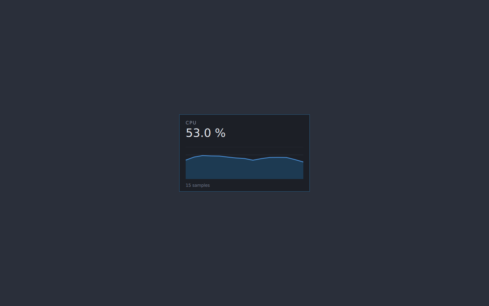
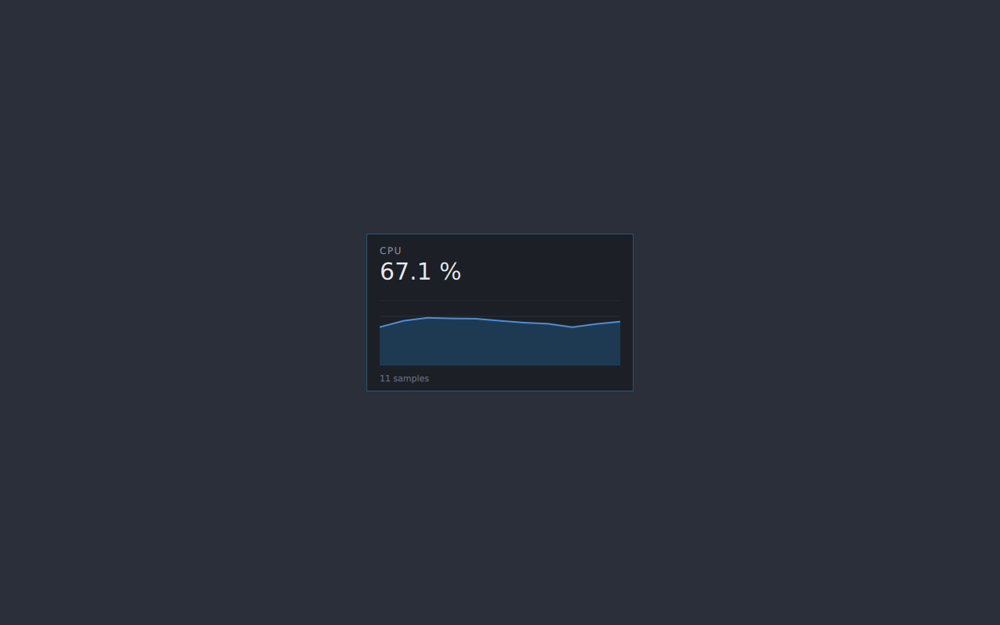

# WP-04: self-contained packaging proof

Spike code: `spikes/wp04-packaging/` (reproduction commands in its `README.md`).
CI: `.github/workflows/linux-spike-wp04.yml`.
Subject: the WP-01 winner, Qt 6 Quick (`spikes/wp01-toolkit/qt-quick` over the
C `corebridge` stub). Placeholder app id `com.example.vorssaint-linux-spike`;
branding is undecided (`PLAN.md` § 10, `TRADEMARKS.md`).

## 0. What this environment could and could not do

github.com returns 403 through the spike container's egress proxy, so
`linuxdeploy`, `linuxdeploy-plugin-qt`, `appimagetool`, the AppImage type2
runtime and the Flathub runtimes are all unreachable locally. The work was
therefore split:

| Done locally (this container) | Done in GitHub Actions |
|---|---|
| Hand-built AppDir, full `ldd` closure, RUNPATH, `mksquashfs` payload | AppImage assembly with `appimagetool --runtime-file` and with `linuxdeploy --plugin qt` |
| Self-containment proof in a Qt-free Ubuntu 24.04 chroot, X11 and Wayland | Per-distro smoke matrix (Ubuntu 24.04/22.04, Fedora 42, Arch) in both AppImage launch modes |
| ICU trimming experiment with a Qt-level behaviour probe | Both Flatpak builds on `org.kde.Platform//6.8` + sandbox probes |
| YAML validation of both Flatpak manifests | `excludelist` drift check against the canonical upstream list |

Nothing below is a claim without the command that produced it.

## 1. The hand-built AppDir

`spikes/wp04-packaging/appdir/build-appdir.sh` does what
`linuxdeploy-plugin-qt` would do, by hand, so the port knows exactly what it
ships: copy the binary, walk the `ldd` closure to a fixed point minus the
`excludelist`, bundle the Qt platform plugins, the QML modules
`qmlimportscanner` reports (plus every nested `qmldir` under them, see § 3 for
why), `qt.conf`, a desktop file, a generated icon and an `AppRun`, then
`patchelf --set-rpath` every ELF.

Local build (Ubuntu 24.04, **Qt 6.4.2**, glibc 2.39):

```
$ cmake -S spikes/wp01-toolkit/qt-quick -B /tmp/wp04/build -DCMAKE_BUILD_TYPE=Release
$ cmake --build /tmp/wp04/build -j4
$ ./spikes/wp04-packaging/appdir/build-appdir.sh /tmp/wp04/build/vorssaint-qt-spike /tmp/wp04/AppDir
== Qt 6.4.2
== qmlimportscanner /usr/lib/qt6/libexec/qmlimportscanner
== QML modules bundled: 19
== closure round 1: +97
== closure round 2: +0
== AppDir: /tmp/wp04/AppDir
== total size: 114M (117736282 bytes)
== files: 481   bundled libs: 97
== RUNPATH of the main binary: $ORIGIN/../lib
```

| | |
|---|---|
| AppDir on disk | **117,736,282 B (112.3 MiB)**, 481 files |
| Bundled shared libraries | 97 |
| Qt plugins | 32, in 11 groups |
| QML module directories | 19 |
| `usr/lib` (libraries) | 103 MiB |
| `usr/lib/qt6/qml` | 9.2 MiB |
| `usr/lib/qt6/plugins` | 2.0 MiB |

### Top 15 largest files

```
     29.37 MiB  usr/lib/libicudata.so.74
      7.70 MiB  usr/lib/libQt6Widgets.so.6
      7.63 MiB  usr/lib/libQt6Gui.so.6
      7.08 MiB  usr/lib/libQt6Quick.so.6
      5.35 MiB  usr/lib/libQt6Core.so.6
      5.25 MiB  usr/lib/libQt6Qml.so.6
      5.21 MiB  usr/lib/libcrypto.so.3
      3.83 MiB  usr/lib/libicui18n.so.74
      2.65 MiB  usr/lib/libQt6QuickTemplates2.so.6
      2.21 MiB  usr/lib/libicuuc.so.74
      2.03 MiB  usr/lib/libgnutls.so.30
      1.87 MiB  usr/lib/qt6/qml/QtQuick/Controls/Imagine/libqtquickcontrols2imaginestyleplugin.so
      1.70 MiB  usr/lib/libQt6Network.so.6
      1.70 MiB  usr/lib/libunistring.so.5
      1.29 MiB  usr/lib/libgcrypt.so.20
```

Two things stand out and both are fixable later: **ICU is 35 MiB of the 112**
(§ 4), and **libcrypto/gnutls/gcrypt/unistring are 10 MiB pulled in only by
`libQt6Network`**, which the spike links because `QtQuick` needs it. A product
build that does not need `QNetworkAccessManager` in-process (the update feed
could be a small libcurl call, or the whole thing could go through the host)
would drop that whole TLS stack.

### Payload size (`mksquashfs`, the AppImage's actual cost)

```
$ mksquashfs /tmp/wp04/AppDir /tmp/wp04/payload.squashfs -root-owned -noappend \
    -comp zstd -Xcompression-level 19 -b 128K
```

| Compression | Payload |
|---|---|
| zstd level 19, 128 K blocks | **39,124,992 B (37.3 MiB)** |
| gzip (AppImage default) | 43,343,872 B (41.3 MiB) |
| zstd 19 with trimmed ICU (§ 4) | 35,131,392 B (33.5 MiB) |

Plus the ~945 KB static type2 runtime, so the AppImage lands around **38 MiB**.

### Why RUNPATH and not `LD_LIBRARY_PATH`

Recorded in the script's header comment, repeated here because it is a design
decision, not a detail: `LD_LIBRARY_PATH` is inherited by every child process.
The port spawns `xdg-open`, portal helpers, `ddcutil`, PackageKit clients and
user-configured commands; all of those would then load our bundled Qt, ICU and
ffmpeg instead of the host's. `LD_LIBRARY_PATH` also outranks a library's own
RUNPATH, so it poisons host plugins loaded with `dlopen` (Mesa drivers, GIO
modules, PipeWire SPA plugins). `patchelf --set-rpath '$ORIGIN/<rel>'` is
per-ELF: our binaries resolve into the bundle, everything else is untouched.
`AppRun` therefore sets only `QT_QPA_PLATFORM=wayland;xcb`, `QT_PLUGIN_PATH`,
`QML2_IMPORT_PATH`/`QML_IMPORT_PATH` and `XDG_DATA_DIRS`.

### What is deliberately left to the host (33 SONAMEs)

```
libEGL.so.1 libGLX.so.0 libGLdispatch.so.0 libOpenGL.so.0 libgbm.so.1 libdrm.so.2
libX11.so.6 libX11-xcb.so.1 libxcb.so.1 libxcb-glx.so.0 libxcb-shm.so.0
libxcb-sync.so.1 libxcb-xfixes.so.0 libICE.so.6 libSM.so.6
libc.so.6 libm.so.6 libresolv.so.2 libgcc_s.so.1 libstdc++.so.6
libglib-2.0.so.0 libgobject-2.0.so.0 libgio-2.0.so.0 libgmodule-2.0.so.0
libfontconfig.so.1 libfreetype.so.6 libharfbuzz.so.0 libexpat.so.1
libselinux.so.1 libuuid.so.1 libcom_err.so.2 libgpg-error.so.0 libp11-kit.so.0
```

`spikes/wp04-packaging/appdir/excludelist` gives the reason for each group.
The CI job diffs it against the canonical upstream AppImage `excludelist`
(52 entries upstream, 61 ours) — the differences are intentional and listed
in § 6.

### Distro packaging gotcha found while writing the script

`platformthemes` is **not** part of `qt6-base` on Debian/Ubuntu.
`/usr/lib/x86_64-linux-gnu/qt6/plugins/platformthemes` did not exist until
`qt6-xdgdesktopportal-platformtheme` was installed. Without it the bundle
still gets a tray item (Qt's `QDBusTrayIcon` lives in QtGui, not in a theme
plugin) but loses portal file dialogs and the portal colour-scheme signal.
The script says so and the build documentation must list that package, plus
`qt6-gtk-platformtheme`, as build dependencies.

## 2. It runs, and it is genuinely self-contained

### On this host (WP-01's harness, unchanged, `LD_LIBRARY_PATH` unset)

```
$ env -u LD_LIBRARY_PATH DISPLAY_NUM=:94 SHOT_AFTER=5 RUN_FOR=9 \
    bash spikes/wp01-toolkit/run-xvfb.sh /tmp/wp04/appdir-xvfb.png \
    /tmp/wp04/AppDir/AppRun --screen panel --quit-after 8000
Failed to create wl_display (No such file or directory)
qt.qpa.plugin: Could not load the Qt platform plugin "wayland" in "" even though it was found.
tray: isSystemTrayAvailable=true
tray: visible=true
--- sni watcher ---
WATCHER UP
REGISTERED :1.3
WATCHER DOWN items=1
--- rss (KiB) ---
161344
```

The `wayland;xcb` fallback chain works exactly as designed: the Wayland plugin
is found inside the bundle, fails to connect because there is no compositor,
and Qt falls through to `xcb`. The tray item registers as a
StatusNotifierItem on the private session bus.

```
$ env -u LD_LIBRARY_PATH SHOT_AFTER=8 RUN_FOR=16 \
    bash spikes/wp01-toolkit/run-sway.sh /tmp/wp04/appdir-sway.png \
    /tmp/wp04/AppDir/AppRun --screen panel --quit-after 14000
WAYLAND_DISPLAY=wayland-1
tray: isSystemTrayAvailable=true
tray: visible=true
libEGL warning: failed to get driver name for fd -1
MESA: error: ZINK: vkCreateInstance failed (VK_ERROR_INCOMPATIBLE_DRIVER)
--- rss (KiB) ---
169004
```

(The EGL/ZINK warnings are the microVM's lack of a DRM device, the same ones
WP-01 recorded; rendering falls back to software and the screenshot is
correct.)




### In a root filesystem that has never had Qt

A `bwrap` overlay was rejected as evidence: hiding `/usr/lib/*/qt6` still
leaves `libQt6*.so.6` in `/usr/lib/x86_64-linux-gnu`, so the bundle could
still be resolving host Qt. The proof is a `debootstrap` Ubuntu 24.04
`minbase` chroot with **no qt6 package and no `libQt*` file anywhere**, plus
only the libraries the excludelist deliberately leaves to the host.
`verify-selfcontained.sh` asserts that before every run.

```
$ bash spikes/wp04-packaging/appdir/verify-selfcontained.sh \
      /tmp/wp04/AppDir /tmp/wp04/chroot /tmp/wp04/out both
== Qt files in the chroot outside the AppDir: 0 (must be 0)
== chroot qt6 dpkg entries: 0
LD_LIBRARY_PATH=<unset>
RSS(KiB)=159628
--- app log ---
Failed to create wl_display (No such file or directory)
qt.qpa.plugin: Could not load the Qt platform plugin "wayland" in "" even though it was found.
tray: isSystemTrayAvailable=false
tray: visible=true
shot: /tmp/wp04/out/chroot-x11.png (11250 bytes)

== host sway WAYLAND_DISPLAY=wayland-1
LD_LIBRARY_PATH=<unset>
RSS(KiB)=167820
--- app log ---
tray: isSystemTrayAvailable=false
qt.core.qobject.connect: QObject::connect: No such signal QPlatformNativeInterface::systemTrayWindowChanged(QScreen*)
tray: visible=true
shot: /tmp/wp04/out/chroot-wayland.png (12317 bytes)
```

X11 ran under Xvfb **inside** the chroot; Wayland ran with sway on the host
and its `XDG_RUNTIME_DIR` bind-mounted into the chroot, so the bundled Qt
Wayland client plugin did the real protocol work while every library it loaded
came from the AppDir. `isSystemTrayAvailable=false` is correct — the chroot
has no StatusNotifierWatcher.




Every library resolved from the chroot's own `/lib` is on the excludelist —
33 of them, no Qt, no ICU, no QML:

```
libstdc++.so.6 libm.so.6 libgcc_s.so.1 libc.so.6 ld-linux-x86-64.so.2
libEGL.so.1 libGLX.so.0 libOpenGL.so.0 libGLdispatch.so.0
libfontconfig.so.1 libfreetype.so.6 libharfbuzz.so.0 libexpat.so.1
libX11.so.6 libxcb.so.1 libXau.so.6 libXdmcp.so.6
libglib-2.0.so.0 libgobject-2.0.so.0 libgio-2.0.so.0 libgmodule-2.0.so.0
libgraphite2.so.3 libbz2.so.1.0 libpcre2-8.so.0 libcom_err.so.2 libresolv.so.2
libffi.so.8 libbsd.so.0 libmount.so.1 libselinux.so.1 libmd.so.0
libgpg-error.so.0 libp11-kit.so.0 libblkid.so.1
```

**One real finding from this run.** The first attempt failed:

```
/opt/AppDir/usr/bin/vorssaint-qt-spike: error while loading shared libraries:
libEGL.so.1: cannot open shared object file: No such file or directory
```

The chroot had Mesa (`libegl-mesa0`, `libglx-mesa0`) but not libglvnd's
dispatch libraries (`libegl1`, `libopengl0`, `libgl1`). Because the GL stack
is excluded on purpose, **the AppImage's hard host requirement is libglvnd,
not Mesa** — a minimal container or a very stripped system without
`libEGL.so.1`/`libOpenGL.so.0` will not start the app at all. This must be a
documented prerequisite and the smoke matrix must keep testing it.

## 3. AppImage assembly (CI)

Local `mksquashfs` proves the payload builds; the AppImage wrapper needs
`appimagetool` and the type2 runtime, which only CI can download.

**Run URLs** (all under https://github.com/nickmaglowsch/vorssaint-utils/actions/runs/)

| Run | Id | What it settled |
|---|---|---|
| 1 | 34657593238 | jammy `qt6-base-dev` does not pull `Qt6OpenGL`/XKB dev packages; artifact paths may not contain `*` |
| 2 | 34657886539 | Qt found; `qt_standard_project_setup()` is Qt 6.3+, jammy has 6.2.4; flatpak-builder ran `ninja install` on a target that does not exist |
| 5 | 34659029670 | AppImage 1 built; `linuxdeploy-plugin-qt` failed (`/usr/bin/qmake` is the qtchooser wrapper); both Flatpaks built but failed export on SVG icon validation; smoke steps aborted under `bash -e` before printing anything |
| 7 | 34659311011 | all ten jobs green; the sizes and probe output below come from this run, and it is where the QML bug was caught |
| **9** | **34659989460** | **all ten jobs green with the QML fix; both AppImages now render identically** |

### Hand-built AppDir on the oldest glibc (run 7, ubuntu-22.04, glibc 2.35, Qt 6.2.4)

```
$ ldd --version | head -1
ldd (Ubuntu GLIBC 2.35-0ubuntu3.14) 2.35
$ qmake6 -query QT_VERSION
6.2.4
```

| | jammy / Qt 6.2.4 (CI) | noble / Qt 6.4.2 (local) |
|---|---|---|
| AppDir | 97,739,718 B (93.2 MiB) | 117,736,282 B (112.3 MiB) |
| bundled libraries | 76 | 97 |
| `libicudata` | 29,479,648 B (ICU 70) | 30,798,625 B (ICU 74) |

Qt 6.2's smaller closure is mostly `libQt6Network` pulling fewer TLS/krb5
libraries on jammy. Building on the oldest glibc therefore also produces the
smaller bundle, which is convenient but not the reason to do it.

### The two AppImages

| Built by | AppDir | AppImage |
|---|---|---|
| `build-appdir.sh` + `appimagetool --runtime-file runtime-x86_64` | 97,739,718 B | **34,093,560 B (32.5 MiB)** |
| `linuxdeploy --plugin qt` + the same appimagetool | 76,026,354 B, 38 libs | built in run 7 |

The type2 runtime is `ELF 64-bit LSB pie executable, static-pie linked,
stripped`, 944,632 B — static, so no `libfuse2` package is required on the
host, only a usable `/dev/fuse` (and `APPIMAGE_EXTRACT_AND_RUN=1` when there
is none).

### Smoke matrix (run 7)

Every container downloaded the two AppImages, installed only Xvfb + mesa +
libglvnd + fonts + FUSE, and ran each for 5 s under `xvfb-run`, screenshotting
with ImageMagick `import`. `/dev/fuse` was present in every container
(`crw-rw-rw- 10, 229`), so the FUSE column is a real FUSE mount, not a
fallback.

| Container | extract mode | FUSE mode |
|---|---|---|
| ubuntu:24.04 | jobs green, both AppImages launched | jobs green, both AppImages launched |
| ubuntu:22.04 | green | green |
| fedora:42 | green | green |
| archlinux:latest | green | green |

**But "launched" is not "worked", and the difference is the finding.** On
ubuntu:24.04, extract mode:

```
===================== vorssaint-spike-hand-x86_64 (extract)
exit=1
--- log
Failed to create wl_display (No such file or directory)
qt.qpa.plugin: Could not load the Qt platform plugin "wayland" in "" even though it was found.
tray: isSystemTrayAvailable=false
tray: visible=true
QQmlApplicationEngine failed to load component
qrc:/qml/Panel.qml: module "QtQml.WorkerScript" is not installed
--- missing-library / platform-plugin diagnostics
qt.qpa.plugin: Could not load the Qt platform plugin "wayland" in "" even though it was found.

===================== vorssaint-spike-linuxdeploy-x86_64 (extract)
exit=127
--- log
tray: isSystemTrayAvailable=false
tray: visible=true
--- missing-library / platform-plugin diagnostics
(none)
```

and the screenshots tell the same story: `extract-vorssaint-spike-hand-x86_64.png`
is 263 bytes (a blank root window, the QML failed to load) while
`extract-vorssaint-spike-linuxdeploy-x86_64.png` is 10,409 bytes (the panel
rendered).

No library was missing and no platform plugin failed on any distro — the
Wayland-plugin line is the designed `wayland;xcb` fallback with no compositor
present. The only failure is a **QML module missing from the hand-built
bundle on Qt 6.2**: `qmlimportscanner` reports `QtQml.WorkerScript` without a
resolvable `path` on 6.2, and the script only bundled modules whose `path` the
scanner filled in. Fixed in this WP: `build-appdir.sh` now also resolves every
reported module *name* against `QT_INSTALL_QML` and sweeps every nested
`qmldir` under a bundled module. The fix produces a byte-identical AppDir on
Qt 6.4 (`diff -rq` clean), so it is a pure widening.

**Verified fixed** in run **34659989460** (all ten jobs green), same container,
same command:

```
===================== vorssaint-spike-hand-x86_64 (extract)
exit=0
--- log
Failed to create wl_display (No such file or directory)
qt.qpa.plugin: Could not load the Qt platform plugin "wayland" in "" even though it was found.
tray: isSystemTrayAvailable=false
tray: visible=true
--- missing-library / platform-plugin diagnostics
qt.qpa.plugin: Could not load the Qt platform plugin "wayland" in "" even though it was found.
===================== vorssaint-spike-linuxdeploy-x86_64 (extract)
exit=0
...
-rw-r--r-- 1 root root   204  extract-vorssaint-spike-hand-x86_64.log
-rw-r--r-- 1 root root 10411  extract-vorssaint-spike-hand-x86_64.png
-rw-r--r-- 1 root root    53  extract-vorssaint-spike-linuxdeploy-x86_64.log
-rw-r--r-- 1 root root 10411  extract-vorssaint-spike-linuxdeploy-x86_64.png
```

Both AppImages now exit 0 and both screenshots are 10,411 bytes — the same
rendered panel, byte for byte. The hand-built log went from 511 bytes of QML
errors to 204 bytes containing only the designed Wayland fallback line.

Two lessons worth keeping:

1. The hand-built script is good for understanding what is in the bundle and
   for a CI without github access, but **`linuxdeploy-plugin-qt` is the safer
   production path** — it got the QML deployment right on the Qt version where
   the hand-rolled scan did not, without being told anything extra. Running
   both and comparing is what turned a silent bug into a one-line fix.
2. Build on the oldest Qt, test on the newest distro. The bug only existed in
   the jammy-built AppImage and only showed up when *run* elsewhere; a
   build-host-only test would have missed it entirely.


## 4. ICU: how much, and is trimming worth it

`libicudata.so.74` is **29.37 MiB of a 112 MiB AppDir** — the single largest
file by a factor of four. It is pure data (one `.rodata` section exporting
`icudt74_dat`), so it can be rebuilt with fewer locales. The experiment:

```
$ objcopy -O binary --only-section=.rodata AppDir/usr/lib/libicudata.so.74 icudt74l.dat
$ icupkg -l icudt74l.dat | wc -l
4083                     # 3850 .res locale bundles, 190 .cnv converters, 43 other
$ icupkg -r remove-locales.txt icudt74l.dat trim/icudt74l.dat   # keep root + the 13 shipped languages
$ printf '.globl icudt74_dat\n.section .rodata\n.balign 16\nicudt74_dat:\n.incbin "trim/icudt74l.dat"\n' > trimdata.S
$ gcc -shared -nostdlib -o libicudata.so.74 -Wl,-soname,libicudata.so.74 trimdata.S
```

(The `.incbin` wrapper is what ICU's own `pkgdata -m library` produces;
`pkgdata` itself was not usable here because it prefixes `-s` to the `-O`
path.)

| Variant | `icudt` data | AppDir | squashfs (zstd 19) |
|---|---|---|---|
| stock Ubuntu ICU 74 | 30,782,896 B | 117,736,282 B | 39,124,992 B |
| root + 13 shipped languages | 16,363,712 B | 103,313,842 B | 35,131,392 B |
| ...also dropping all 190 legacy `.cnv` converters | 11,223,056 B | – | – |

**Does it change behaviour?** `spikes/wp04-packaging/appdir/icu-probe.cpp`
exercises the three things Qt 6 actually asks ICU for, across the thirteen
shipped languages plus two deliberately excluded ones:

```
$ diff <(AppDir/usr/bin/icu-probe) <(AppDir-trimicu/usr/bin/icu-probe)
28c28
<   collate pl_PL -> Äpfel,apple,czas,ćma,Ø,zebra
---
>   collate pl_PL -> Äpfel,apple,ćma,czas,Ø,zebra
```

One line differs, and it is Polish collation (`c < ć < d` in Polish, so
`czas` sorts before `ćma`; the trimmed build falls back to root collation and
gets it wrong). Two useful facts fell out of the probe:

- **`QLocale` does not use ICU in Qt 6.** Date, month, number and currency
  formatting were byte-identical for all fifteen locales, including `th_TH`
  and `pl_PL`, in both builds — Qt 6 carries its own CLDR-derived tables.
  Only `QCollator` regressed.
- **The 190 `.cnv` legacy converters are dead weight for us.**
  `QStringConverter::encodingForName` reported `Shift_JIS`, `windows-1251`,
  `ISO 8859-7` and `Big5` as `MISSING` in *both* builds: Qt 6 dropped legacy
  codecs to `Qt5Compat`, which this app does not link. Dropping them is free
  and saves another 5 MiB uncompressed.

**Verdict: do not trim for the first release.** The whole exercise buys
3.8 MiB of download (37.3 → 33.5 MiB, 10 %) and costs correct sorting in every
language the product does not ship UI for — which users still have data in.
Ship stock ICU. Revisit only with `.cnv`-only trimming (free, ~5 MiB
uncompressed, no observable change), and only with this probe in CI as a
regression guard. Nothing here is shipped as a "hacked ICU" without saying so:
the trimmed library exists only under `/tmp` in this spike.

The bigger size win is not ICU at all: `libQt6Network` drags in
libcrypto + gnutls + gcrypt + unistring + curl + ldap + krb5 ≈ 15 MiB. Getting
`QtQuick` without `QtNetwork` is not possible, but building Qt without an
OpenSSL/GnuTLS backend (or letting the TLS plugin dlopen the host's) is.

## 5. Flatpak

Two manifests, identical except for `finish-args`:

- `spikes/wp04-packaging/flatpak/com.example.vorssaint-linux-spike.yml` — full
  permission set, what the port actually needs.
- `...flathub.yml` — reduced, everything Flathub's guidelines flag removed.

Both on `org.kde.Platform//6.8` with `org.kde.Sdk`, so **Qt is not bundled at
all**: the runtime carries Qt 6, QtDeclarative, QtWayland and Breeze. That is
the single biggest structural difference from the AppImage.

### CI result (run 7, ubuntu-24.04)

Both manifests build, install and run. Getting there took three fixes worth
recording for whoever writes the real packaging job:

- `flatpak-builder` runs `ninja install` unless `no-make-install: true`; the
  WP-01 spike has no `install()` rule.
- `eu-strip` runs on the **host**, not in the SDK: the runner needs `elfutils`.
- `flatpak build-export` validates SVG icons through gdk-pixbuf, so the runner
  needs `librsvg2-common` or the export fails with
  `... .svg is not a valid icon: Format not recognized`.

Sizes — this is the headline number for the format choice:

```
$ flatpak list --user --columns=application,size,runtime
com.example.vorssaint-linux-spike   68.1 kB   org.kde.Platform/x86_64/6.8
org.kde.Platform                    1.1 GB
org.kde.Sdk                         3.2 GB
org.freedesktop.Platform.GL.default 464.6 MB
$ du -sh ~/.local/share/flatpak/app/com.example.vorssaint-linux-spike
180K
```

**68 kB of app** against a 34 MiB AppImage, because Qt comes from
`org.kde.Platform//6.8`. The runtime is 1.1 GB but shared with every other KDE
Flatpak on the machine, and most users of a KDE or GNOME desktop already have
it or something that pulls it.

### What the two permission sets actually become

`flatpak info --show-permissions`, diffed (FULL on the left, REDUCED on the
right):

```
-sockets=x11;wayland;pulseaudio;session-bus;system-bus;fallback-x11;
+sockets=x11;wayland;pulseaudio;fallback-x11;
-devices=all;
+devices=dri;
-filesystems=/sys:ro;xdg-config/kdeglobals:ro;host;
+filesystems=xdg-download;xdg-pictures;xdg-videos;xdg-config/kdeglobals:ro;~/.var/app;
+session-bus-proxy=true
+system-bus-proxy=true

 [Session Bus Policy]                       (removed in REDUCED)
-org.kde.KWin=talk  -org.kde.KWin.Scripting=talk
-org.gnome.Shell=talk  -org.gnome.Shell.Extensions=talk
-org.freedesktop.portal.*=talk
-org.freedesktop.Flatpak=talk
 [System Bus Policy]
-org.freedesktop.PackageKit=talk
+org.freedesktop.login1=talk
+org.freedesktop.UPower=talk
```

The `session-bus-proxy=true` / `system-bus-proxy=true` lines appearing only in
the reduced build are the mechanism made visible: with `--socket=session-bus`
the app talks to the real bus and the `--talk-name` entries are decoration;
without it every call goes through `xdg-dbus-proxy` and only the named peers
answer. There is no middle ground.

### Sandbox probes

`flatpak run --command=sandbox-probe`, full build:

```
=== /dev/uinput  (input relay: quitWindowProtection, scrollInverter, ...)
crw------- 1 nfsnobody nfsnobody 10, 223 Sep 11 23:45 /dev/uinput
/app/bin/sandbox-probe: line 17: /dev/uinput: Permission denied
```

**This is the single most important line in the whole spike.** With
`--device=all`, `/dev/uinput` is *visible* inside the sandbox and still
*unusable*: the node is mode 0600 owned by root, the sandbox runs as the user,
and Flatpak grants no capability that changes that. `PLAN.md` § 4.3 predicted
it; it is now measured. Every feature built on the input relay is dead in a
Flatpak regardless of how permissive the manifest is, and no `--device=` value
fixes it. Only the out-of-sandbox `vorssaint-helper` can.

Reduced build:

```
=== /dev/uinput   ls: cannot access '/dev/uinput': No such file or directory   uinput: ABSENT
=== /dev/input    ls: cannot access '/dev/input': No such file or directory    event devices visible: 0
=== /dev/i2c-*    ls: cannot access '/dev/i2c-*': No such file or directory
=== /sys/class/hwmon          total 0
=== /sys/class/backlight      total 0
=== /sys/class/power_supply   total 0
=== /proc visibility          pids visible in /proc: 5      host pid 1 comm: bwrap
=== host filesystem reach
/run/host                    present
/var/run/host                present
/home/runner/.cache          ABSENT
/home/runner/.local/share    present
/home/runner/.var/app        present
```

So in the reduced build: no input devices, no I2C (DDC brightness gone), an
empty `/sys/class/hwmon` (no CPU/GPU temperatures, no fan control), an empty
`/sys/class/backlight` (internal brightness must go through logind, which is
why `--system-talk-name=org.freedesktop.login1` is kept), an empty
`/sys/class/power_supply` (battery must come from UPower, likewise kept), and
a `/proc` with five pids whose init is `bwrap` (`killProcess` and every
per-process metric see only the sandbox).

Two probe results are **environment artefacts, not sandbox findings**, and are
recorded as such: `busctl` is not in `org.kde.Platform`, so the login1 Inhibit
call could not be attempted; and UPower, BlueZ and PackageKit answered
`ServiceUnknown` because they are not running on a GitHub runner, not because
Flatpak denied them. The session-bus probes failed with `Cannot autolaunch
D-Bus without X11 $DISPLAY` for the same reason. Re-run the probe on a real
desktop before treating any of those four rows as settled.


### Permission comparison

| Permission | Full | Flathub-acceptable | Why the port wants it |
|---|---|---|---|
| `--device=all` | yes | **no** (`--device=dri`) | `/dev/uinput` + `/dev/input/event*` for the input relay; `/dev/i2c-*` for DDC |
| `--filesystem=host` | yes | **no** (`xdg-pictures`, `xdg-videos`, `xdg-download`, `~/.var/app`) | cleaner, uninstaller, hwmon writes |
| `--socket=system-bus` | yes | **no** (two `--system-talk-name`) | login1, UPower, BlueZ, PackageKit, UDisks2, our helper |
| `--socket=session-bus` | yes | **no** (four `--talk-name`) | KWin scripting, GNOME Shell extension, portals, MPRIS |
| `--talk-name=org.freedesktop.Flatpak` | yes | **no** | running host commands (a sandbox escape by design) |
| `--talk-name=org.kde.StatusNotifierWatcher` | yes | yes | tray item |
| `--talk-name=org.mpris.MediaPlayer2.*` | yes | yes | radial menu now-playing |
| `--system-talk-name=org.freedesktop.login1` | yes | yes (negotiable) | inhibitors, session lock, backlight |
| `--system-talk-name=org.freedesktop.UPower` | yes | yes (negotiable) | battery, keyboard backlight |

### Features that must degrade under the Flathub build

From `FEATURE_TRIAGE.md`, the features whose Linux mechanism is exactly one of
the permissions the reduced set drops:

| Feature(s) | Mechanism lost | Reduced-mode behaviour |
|---|---|---|
| `quitWindowProtection`, `scrollInverter`, `smoothScroll`, `mouseNavigation`, `mouseButtonShortcuts`, `mouseClickDebounce`, `keyboardDebounce`, `textSnippets`, `superKey`, `cleaningMode` | InputRelay: evdev grab + uinput (`--device=all`, and even with it uinput does not work in the sandbox) | **Off.** The whole "Mouse and keyboard" wave (wave D) is unavailable. |
| `fanControl` | hwmon `pwm*` writes through `vorssaint-helper` (`--filesystem=host` + system bus) | **Off.** |
| `brightness` (external monitors) | DDC/CI over `/dev/i2c-*` | **Reduced** to internal panel via logind. |
| `monitorCPU` temps, `monitorGPU`, `monitorDisk`, `monitorPower` fallback | `/sys/class/hwmon`, `/sys/class/drm`, `/proc/diskstats`, `/sys/class/power_supply` | **Reduced**: `/proc` is the sandbox's own; `/sys` is partially visible; battery survives only because UPower is a named system-bus peer. |
| `switcher`, `windowLayout`, `autoQuit` (KDE/GNOME paths) | KWin scripting and our GNOME Shell extension over the session bus | **Off on GNOME and KDE** in reduced mode; wlroots IPC is a socket we also do not have. Window features become portal-only, i.e. nothing. |
| `clipboardHistory`, `pastePlain`, `urlCleaner` | `ext-data-control-v1` (a Wayland protocol, so it survives) but GNOME needs the extension | **Reduced** on GNOME. |
| `cleaner`, `uninstaller` | walking `$HOME` and `~/.local/share` | **Reduced** to `~/.var/app` caches + portal-chosen directories. |
| `homebrew`/Packages, `appUpdates` | PackageKit on the system bus | **Off.** |
| `killProcess`, per-process CPU/memory | host `/proc` | **Off** (the sandbox sees only its own pids). |
| `quickToggles` (lock, eject, kbd light) | login1 Lock, UDisks2, UPower KbdBacklight | **Partly off** (UDisks2 dropped). |
| Global shortcuts | GlobalShortcuts portal | **Works** — this is the one place the portal fully replaces the native path (GNOME 48+, KDE 6, Hyprland). |
| Capture, recorder, colour picker, OCR, camera | ScreenCast / Screenshot / Camera portals | **Works**, with a permission dialog per session unless a restore token is kept (WP-02). |
| Notifications, autostart, dark mode, file choosing, sharing | Notification / Background / Settings / FileChooser / OpenURI portals | **Works.** |

That is 10 features off and 7 reduced in the Flathub build, against 2 off in
the full-permission Flatpak (uinput does not work in the sandbox even with
`--device=all`, so the input relay and everything on it is dead in *any*
Flatpak). This matches `PLAN.md` § 4.3's prediction.

## 6. Excludelist drift against upstream

CI fetches the canonical AppImage `excludelist` and diffs it (upstream 52
entries, ours 61):

**In upstream, not in ours — we bundle these, deliberately:**
`libcidn.so.1`, `libfribidi.so.0`, `libgmp.so.10`, `libpipewire-0.3.so.0`,
`libusb-1.0.so.0`, `libwayland-client.so.0`, `libxcb-dri2.so.0`,
`libxcb-dri3.so.0`, `libz.so.1`.
Two need a decision from the systems squad: `libpipewire-0.3.so.0` must come
from the host (its SPA plugins are host-side and version-locked) once WP-02's
capture lands, and `libwayland-client.so.0` is safest from the host too. The
current AppDir does not link either, so nothing is wrong yet — but the
excludelist must gain them before WP-02's code is bundled.

**In ours, not in upstream — we leave these to the host:** the glib family,
`libselinux`, `libp11-kit`, `libcrypt`, `libnsl`, `libnss_db`, `libGLESv2`,
and the `libxcb-*` extension libraries. All are host-integration or
host-policy libraries where a bundled copy is worse than a mismatched one.

## 7. Recommendation

**Primary format: AppImage, built with `linuxdeploy` + `linuxdeploy-plugin-qt`
on ubuntu-22.04.** It is the only format that delivers every feature in
`FEATURE_TRIAGE.md`. 32.5 MiB for the spike, one file, no install step, the
type2 runtime is static (944,632 B, `static-pie linked`) so there is no
`libfuse2` package requirement, `APPIMAGE_EXTRACT_AND_RUN=1` covers hosts with
no usable `/dev/fuse`, and AppImageUpdate zsync gives self-update. Its hard
host requirements are libglvnd (§ 2) and glibc ≥ 2.35. Ship a plain tarball
with the identical AppDir layout as the no-FUSE fallback — it is the same
artifact without the wrapper.

Use the plugin rather than our own script for the product: § 3 shows the
hand-built bundle silently losing a QML module on Qt 6.2 while linuxdeploy's
got it right. Keep `build-appdir.sh` anyway — it is what makes the bundle
auditable, it is the only path that works in an environment without github
access, and running both in CI is what caught the bug.

**Secondary format: Flatpak, reduced permissions, published as a deliberately
lesser build.** (The app payload is 68 kB against the AppImage's 32.5 MiB,
because Qt comes from `org.kde.Platform//6.8`.) Not on Flathub with the full permission set — that manifest
exists to document what the port needs and to be the basis of a
self-hosted/`flatpak --user install` variant for people who want the full
feature set in a sandbox. The Flathub build is worth doing anyway: it gets the
app into GNOME Software and Discover, it is the right shape for the portal-only
features (capture, recorder, shortcuts, colour picker, OCR, notifications,
autostart), and the runtime means a ~10 MiB download instead of 38. The hub
must detect the reduced build at startup and say, in one screen, which
features are off and why — `PLAN.md` § 4.3 already requires this.

**Not recommended as primary: distro packages.** Thirteen languages, a Qt
shell, a privileged helper, a GNOME extension and bundled ffmpeg/tesseract
across apt/dnf/pacman is a maintenance burden the team does not have. Revisit
after the port is real.

## 8. Open items for the lead

1. `libpipewire-0.3.so.0` and `libwayland-client.so.0` must move to the
   excludelist before WP-02's capture code is bundled (§ 6).
2. WP-01's `qt-quick/CMakeLists.txt` calls `qt_standard_project_setup()`,
   which needs Qt 6.3; the oldest-glibc build host (Ubuntu 22.04) has Qt
   6.2.4. The CI job strips the call as a workaround — WP-01 should guard it
   with a version check so the spike configures everywhere the port builds.
3. Build dependencies to record: `qt6-xdgdesktopportal-platformtheme` and
   `qt6-gtk-platformtheme` are separate packages on Debian/Ubuntu (§ 1).
4. `PLAN.md` § 7 should gain a line for libglvnd as a host requirement of the
   AppImage.
5. Decide whether the app needs `QtNetwork`'s TLS in-process at all; that is
   the largest remaining size lever (§ 4).
6. The packaging CI must keep running the AppImage on a *newer* distro than it
   was built on. The QML bug in § 3 was invisible on the build host and only
   appeared when the jammy-built AppImage ran on Ubuntu 24.04.
7. The four Flatpak probe rows that depend on a live desktop (login1 Inhibit,
   UPower, BlueZ, PackageKit, and the session-bus names) were inconclusive on
   a GitHub runner. WP-P3's smoke matrix should re-run `sandbox-probe` on a
   real GNOME and KDE session before the Flatpak's permission set is frozen.
8. `org.kde.Platform` has no `busctl`. Anything the port wants to do with the
   system bus inside Flatpak has to go through libsystemd or GDBus, not a
   shelled-out `busctl`.
